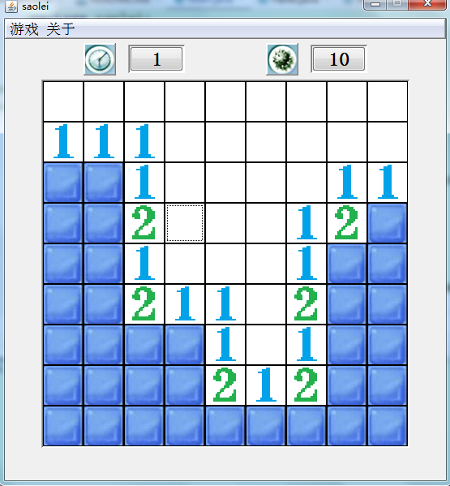

<h1 align="center">扫雷游戏系统</h1>

## 简介
扫雷游戏系统：界面简洁，功能齐全，支持计时器和雷数显示，提供左键翻开和右键标记功能，帮助玩家推理排雷，目标是排除所有非雷方格并标记雷的位置。    --计算机毕业设计源码；毕设源码；java毕业设计源码

## 联系方式

<h3 align="center">获取完整代码与数据库文件 + 微信：deepguan QQ: 86050149 QQ群: 783742310</h3>

<h3 align="center">可帮忙远程部署 包运行成功！提供远程部署、修改代码、设计文档指导、代码讲解等服务！</h3>

## 功能介绍（完整见运行截图）
玩家：界面上方有计时器和雷数显示，帮助掌握游戏进度。通过点击方格进行操作，未翻开的方格可能隐藏地雷，翻开后若无雷则显示周围雷数。右键点击可标记疑似雷的位置，避免误触。目标是排除所有非雷方格并成功标记所有雷的位置。

## 运行截图

本代码来源于网络,仅供学习参考使用!

